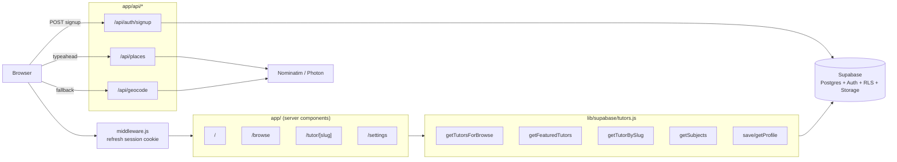
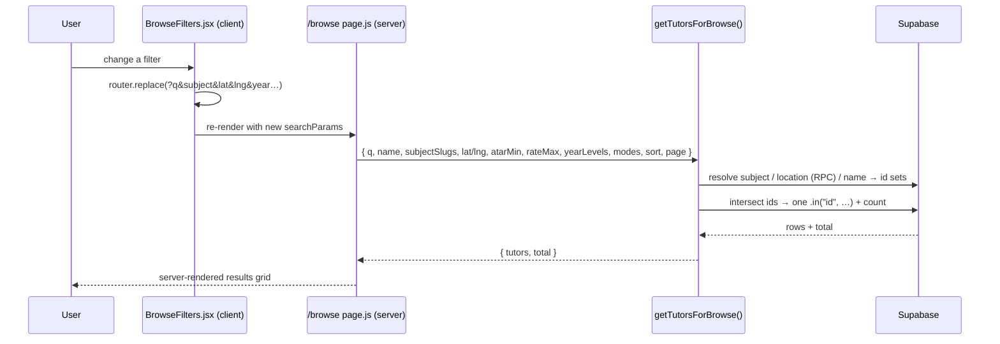
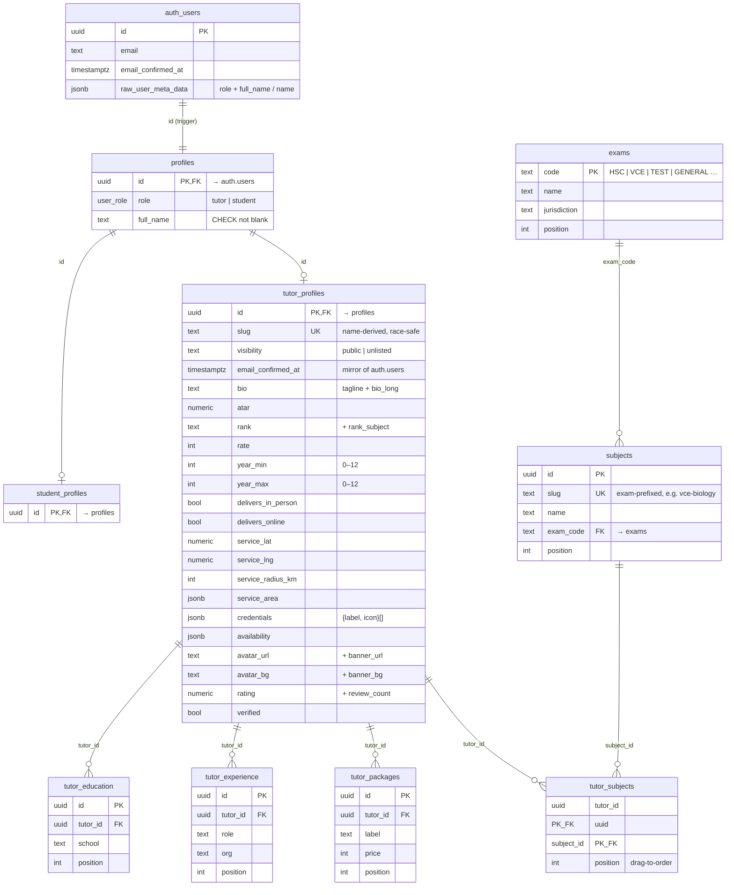

# matchtutor

A marketplace web app for finding and booking academic tutors across Australian senior-secondary exams (HSC, VCE, IB, QCE, SACE, WACE, TCE, ACT) and admissions tests (UCAT, GAMSAT, LAT). Live at **[matchtutor.com.au](https://matchtutor.com.au)**.

Built with Next.js 14 (App Router), Tailwind CSS, and Supabase. For contributor-level detail — naming conventions, architectural rules, query-helper shapes — see [`CLAUDE.md`](./CLAUDE.md).

---

## Tech stack

| Layer | Choice |
| --- | --- |
| Framework | Next.js 14.2 (App Router), React 18.3 |
| Language | JavaScript (no TypeScript) |
| Styling | Tailwind CSS 3.4 + inline `style={{ }}` for design tokens |
| Animation | `motion` 11 (Framer Motion) + `lenis` smooth scroll |
| Backend | Supabase (Postgres + Auth + RLS) via `@supabase/ssr` 0.5 + `@supabase/supabase-js` 2.45 |
| Maps | `leaflet` 1.9 + `react-leaflet` 4.2 — OpenStreetMap tiles (CARTO fallback), no key |
| Geocoding | Nominatim primary, Photon (Komoot) fallback — no keys |
| Image crop | `react-easy-crop` for avatar/banner uploads |
| Icons | Self-contained Lucide-style SVG set in `components/Icon.js` |

---

## How it fits together

Public pages are **server components** that query Supabase at request time through `lib/supabase/tutors.js`. Interactive bits (search, filters, editor, maps) are small **client components**. There is no in-memory data fallback — empty DB renders empty states.



### Request → data flow on `/browse`

URL query string is the single source of truth for filter state, so every result page is shareable and back-button-friendly.



### Auth flows

```mermaid
graph TD
    subgraph Email["Email + password"]
        S1["/signup form"] -->|POST| S2["/api/auth/signup<br/>password + email-domain (MX) check"]
        S2 -->|auth.signUp| S3[("auth.users")]
        S3 -->|handle_new_user trigger| S4["profiles + tutor_profiles + slug"]
    end

    subgraph OAuth["Google OAuth (PKCE)"]
        O1["Continue with Google"] -->|signInWithOAuth| O2["Google consent"]
        O2 -->|?code=| O3["/auth/callback<br/>exchangeCodeForSession"]
        O3 --> O4["/settings"]
    end

    subgraph Reset["Password reset"]
        R1["/forgot-password"] -->|POST| R2["/api/auth/forgot-password<br/>resetPasswordForEmail"]
        R2 -->|email link| R3["/auth/callback<br/>verifyOtp (recovery)"]
        R3 --> R4["/reset-password → /login?reset=1"]
    end
```



---

## Project layout

```mermaid
graph TD
    root["tutor-match/"]

    root --> app["app/"]
    root --> comp["components/"]
    root --> lib["lib/"]
    root --> sb["supabase/"]
    root --> mw["middleware.js<br/>jsconfig.json · *.config.*"]

    app --> auth["(auth)/ — login · signup ·<br/>forgot-password · reset-password"]
    app --> apidir["api/ — auth/signup · auth/forgot-password<br/>places · geocode"]
    app --> callback["auth/callback/ — OAuth + recovery landing"]
    app --> browse["browse/ — page + BrowseFilters + ResultsGrid"]
    app --> tutor["tutor/[slug]/ — page + Rate/About/Availability/<br/>Service-area/Education/Experience cards"]
    app --> settings["settings/ — page · SettingsEditor · sections"]
    app --> account["account/ — change password · delete account"]
    app --> pages["page.js (home) · layout.js · messages/"]

    comp --> ui["ui.js · Icon.js · TopNav · Footer · TutorCard"]
    comp --> home["HomeHero · HomeFeaturedTutors · HomeHowItWorks · HomeCta"]
    comp --> pick["SubjectPicker · SuburbAutocomplete · OAuthButtons · PasswordChecklist"]
    comp --> media["ServiceMapLeaflet · ImageCropModal · RichText · anim/*"]

    lib --> data["supabase/ — client · server · storage · tutors"]
    lib --> dom["password · email · mailDomain · subjects · yearLevels · availability"]
    lib --> loc["places · geocode · richText · motion"]

    sb --> migr["migrations/ — 0001 … 0017"]
    sb --> tmpl["email-templates/ — confirm-signup · reset-password"]
    sb --> reset["reset/ — data_reset · delete_user (dev only)"]
```



`_design/` holds the original HTML/CSS/JS prototype (gitignored) — treat it as the read-only source of truth for visual decisions.

---

## Routes

| Path | File | Notes |
| --- | --- | --- |
| `/` | `app/page.js` | Server. Hero search, featured tutors, how-it-works, CTA. |
| `/browse` | `app/browse/page.js` | Server. Filter state parsed from `searchParams`; `getTutorsForBrowse()`. Geospatial location via `tutors_within_service_radius` RPC. Sidebar rewrites the URL on every change. |
| `/tutor/[slug]` | `app/tutor/[slug]/page.js` | Public profile via `getTutorBySlug()`; `notFound()` unless `visibility = 'public'`. Leaflet service-area map when coords exist. |
| `/settings` | `app/settings/page.js` | Tutor profile editor. Redirects to `/login` if unauthenticated. Avatar + banner uploads, drag-to-order subjects, live map preview. |
| `/account` | `app/account/page.js` | Change password (re-verifies current) + delete account (`delete_own_account` RPC). |
| `/signup`, `/login` | `app/(auth)/…` | Email + password forms + Google OAuth. Tutor-only (Student "coming soon"). |
| `/forgot-password`, `/reset-password` | `app/(auth)/…` | Password recovery (no email enumeration). |
| `/auth/callback` | `app/auth/callback/route.js` | Landing for OAuth (`?code=` → `exchangeCodeForSession`) and recovery (`token_hash` → `verifyOtp`). |
| `/api/auth/signup` | route | `POST { fullName, email, password, role }` — re-validates password + email domain (MX/A lookup) then `auth.signUp`. Returns `session \| confirm \| exists`. |
| `/api/auth/forgot-password` | route | `POST { email }` → `resetPasswordForEmail`. Always neutral response. |
| `/api/places` | route | `GET ?q` → up to 6 AU suburb matches `{ label, suburb, state, postcode, lat, lng }` (Photon → Nominatim). Primary location path. |
| `/api/geocode` | route | `GET ?q` → `{ lat, lng }` single result (Nominatim → Photon). Fallback path. |
| `/api/ai/generate-bio` | route | `POST { kind, profile }` → AI tagline/long-bio copy via Groq. Auth-gated, 10/day per user (`consume_ai_credit` RPC). |
| `/messages` | `app/messages/page.js` | Stub ("coming soon"); not linked from nav. |

---

## Getting started

### 1. Install

```bash
npm install
```

### 2. Configure Supabase

1. Create a project at <https://supabase.com>.
2. Copy `.env.example` → `.env.local` and set:
   - `NEXT_PUBLIC_SUPABASE_URL` — Project Settings → API → Project URL.
   - `NEXT_PUBLIC_SUPABASE_ANON_KEY` — the `anon public` key. **Not** the `service_role` key (it bypasses RLS).
3. Run every file in `supabase/migrations/` (`0001`–`0020`) **in numeric order** in the SQL Editor — they build the schema below incrementally.

Without Supabase configured, public pages render empty states and signup/login fail.

### 3. Configure auth email (Resend SMTP)

Confirmation/recovery emails are sent **by Supabase over Resend custom SMTP** — there is no Resend key in `.env.local` (the app never sends mail itself). This replaces Supabase's built-in sender (~2/hr, poor deliverability).

1. Create a [Resend](https://resend.com) API key (`re_…`).
2. Supabase → **Project Settings → Authentication → SMTP Settings** → enable Custom SMTP: host `smtp.resend.com`, port `465`/`587`, username `resend`, password = the key. Sender `onboarding@resend.dev` until a domain is verified.
3. **Authentication → Emails** → paste `supabase/email-templates/confirm-signup.html` (Confirm signup) and `reset-password.html` (Reset Password). Re-paste after any edit — Supabase renders the live copy.
4. **Authentication → Rate Limits** → raise emails/hour above 2.
5. **Authentication → URL Configuration** → set **Site URL** to the live domain, and add **wildcard** Redirect URLs for every origin: `https://matchtutor.com.au/auth/callback**` and `http://localhost:3000/auth/callback**`. The `**` is required — the `?next=…` query string won't match a bare entry, and a failed match silently falls back to the Site URL.

With no verified domain, `onboarding@resend.dev` only delivers to your own Resend account email — sign up with that address when testing. Going live: verify a domain (SPF/DKIM/DMARC) in Resend, then set the Sender to e.g. `noreply@matchtutor.com.au`.

### 4. Configure Google OAuth

The OAuth client secret lives in the Supabase dashboard, not `.env.local` — the app only calls `supabase.auth.signInWithOAuth`.

1. **Google Cloud Console → Credentials → OAuth client ID → Web application**. Authorized redirect URI = your Supabase callback `https://YOUR-REF.supabase.co/auth/v1/callback`. Copy the Client ID + secret.
2. **Supabase → Authentication → Providers → Google** → enable and paste them.
3. Ensure the wildcard Redirect URLs from step 3 cover `<origin>/auth/callback**`.

A first-time Google user carries no `role` metadata, so the `handle_new_user()` trigger (`0016`) defaults them to a confirmed tutor and takes their name from Google's `name` claim.

### 5. Configure AI profile copy (Groq) — optional

`/settings → About` can AI-generate a tutor's **tagline** and **long bio** from their own profile data. It runs **server-side only** through [Groq Cloud](https://console.groq.com).

1. Create a Groq API key at **console.groq.com → API Keys**.
2. Set `GROQ_API_KEY` in `.env.local` (a server secret — **no** `NEXT_PUBLIC_` prefix, never shipped to the browser). Optionally override `GROQ_MODEL` (defaults to `llama-3.3-70b-versatile`).
3. Each tutor is capped at **10 generations/day**, enforced by the `consume_ai_credit` RPC in migration `0020` (so the limit holds across serverless instances). A failed Groq call refunds the credit.

Leaving `GROQ_API_KEY` unset simply disables the feature — the button surfaces an error instead of generating.

### 6. Run

```bash
npm run dev      # http://localhost:3000
npm run build    # production build (needs the two NEXT_PUBLIC_* vars; placeholders OK for smoke tests)
npm run start    # serve the production build
```

No tests are configured.

---

## Database schema

**Option B layout:** a shared `profiles` row (1:1 with `auth.users`) plus a role-specific extension table keyed by the same uuid. A `handle_new_user()` trigger creates the matching rows on signup. Public reads are gated on `visibility = 'public'` **and** a non-null `email_confirmed_at`. RLS is self-write everywhere, public-read on tutor + catalog data.



**Key DB functions:** `handle_new_user()` (signup trigger — OAuth-safe, defaults role to tutor), `tutors_within_service_radius(lat, lng, include_online)` (haversine RPC for location search), `assign_tutor_slug(name)` (race-safe slug regen on rename), `delete_own_account()` (`SECURITY DEFINER`, scoped to `auth.uid()`). Plus a public `profile-images` Storage bucket (owner-scoped RLS) for avatar/banner uploads.

The schema is built incrementally by the 17 ordered files in `supabase/migrations/` (`0001`–`0017`; three independent `0014_*` files) — apply them all in numeric order. `supabase/reset/` holds dev-only destructive scripts.

---

## Architecture notes

### Styling

A deliberate mix of **Tailwind utilities** for layout and **inline `style={{ }}`** for the specific colors/radii/borders from the design — keeping design tokens local to where they're used. Card hover-lift is driven by `motion/react` variants (Tailwind `hover:` can't override an inline `style.border`). Don't refactor inline styles into a global stylesheet without a reason.

### Supabase clients

- `lib/supabase/client.js` — `createBrowserClient` for client components.
- `lib/supabase/server.js` — `createServerClient` wired to `cookies()` for server components / route handlers.
- `middleware.js` — calls `getUser()` on every request to refresh the session cookie (official `@supabase/ssr` pattern; matcher excludes static assets).

### Signup gate

The form POSTs to `/api/auth/signup` (it never calls `supabase.auth.signUp` from the client). The route re-validates the password (`lib/password.js`), email format (`lib/email.js`), and that the domain can receive mail (`lib/mailDomain.js` — DNS MX → A/AAAA fallback, so `gmial.con` is rejected), then signs up server-side. The DB trigger — not the client — decides which extension table gets a row. Never insert into `profiles`/extension tables from the client.

### Query helpers (`lib/supabase/tutors.js`)

All take a Supabase client as the first arg (work from server + browser). Subject, location, and name filters each resolve to a tutor-id set first, then intersect into one `.in("id", …)` so the exact count and pagination stay correct. Public reads filter `visibility = 'public'` **and** confirmed email.

### Maps & geocoding

Service area renders as a real Leaflet + OSM map (CARTO Voyager tiles after >3 `tileerror`s). `SuburbAutocomplete` (debounced `/api/places`, Photon primary) is the primary location picker — a selected suggestion already carries `{ lat, lng, state }`, so no second round-trip. `/api/geocode` (Nominatim primary) is the single-result fallback. Both Nominatim/Photon are free, keyless, OSM-based; the public profile hides the map entirely when coords are missing.

### State & navigation

`/browse` filter state lives in the URL (`router.replace()` on every change). `components/TopNav.js` is auth-aware: logged-in users get an avatar-chip dropdown; logged-out users see only Log in + Sign Up. `jsconfig.json` maps `@/*` to the project root.
